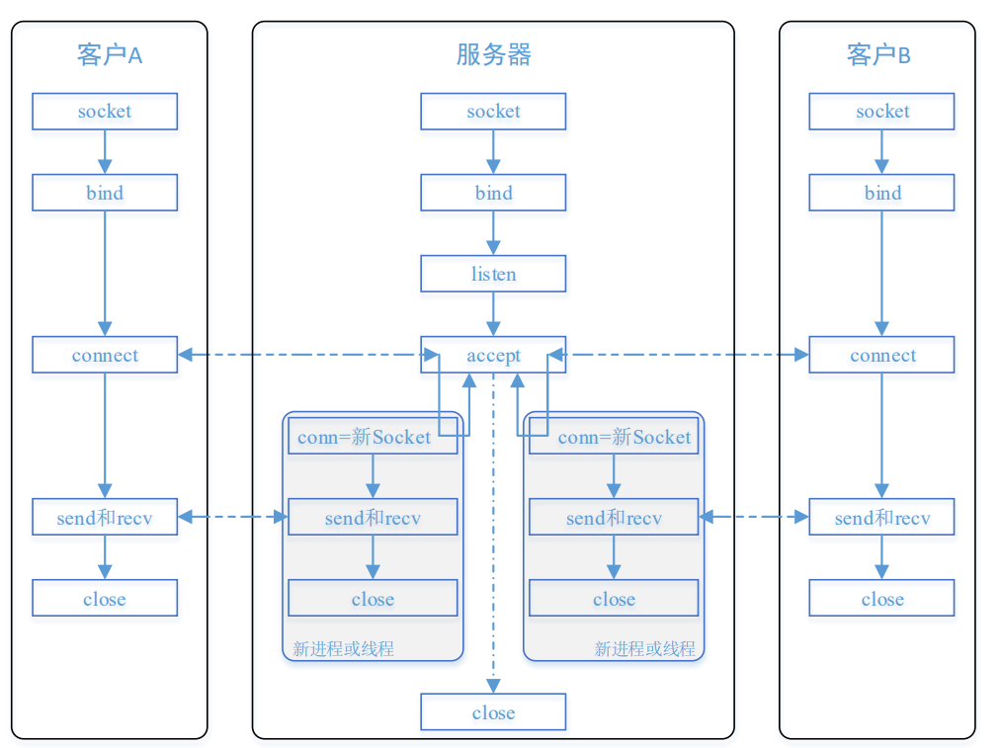
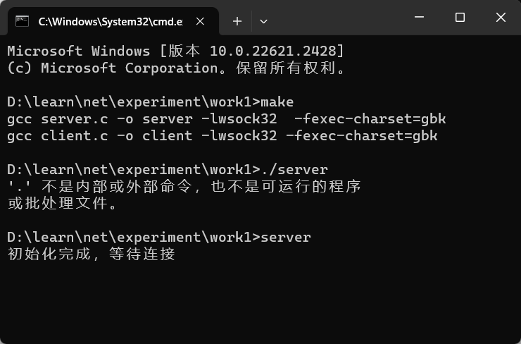
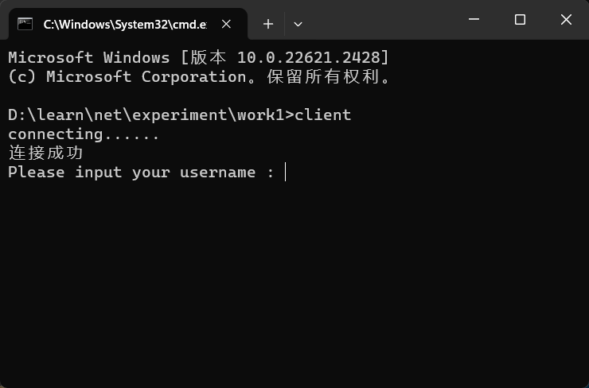
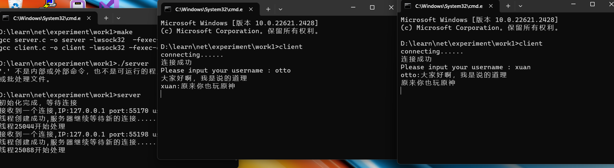
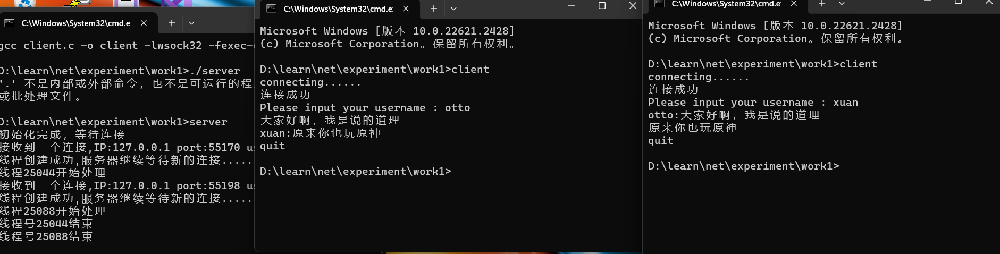

## 编程作业一：基于TCP协议的网络聊天室

学号：2111698

姓名：于泽林

### 协议设计

- 基于TCP协议设计，采用C/S架构

- 数据报格式：**username : message**

- 服务器监听自己的**1234**端口，等待客户端的连接
- 连接交由新的线程处理，主线程继续等待新的连接
- 服务端将用户输入的消息转发给其他所有已激活的客户端
- 用户输入“**quit**”结束连接，线程关闭



### 各模块功能

- 服务端

加载winsock2环境

```
WSADATA wd;
if (WSAStartup(MAKEWORD(2, 2), &wd) != 0)
{
    printf("WSAStartup error\n");
    return 1;
}
```

创建流式套接字

```
SOCKET welcome = socket(AF_INET, SOCK_STREAM, IPPROTO_TCP);
if (welcome == INVALID_SOCKET)
{
    printf("create socket error\n");
    return 1;
}
```

绑定服务器IP和端口

```
sockaddr_in addr;
memset(&addr, 0, sizeof(addr));
addr.sin_family = AF_INET;
addr.sin_port = htons(1234);
addr.sin_addr.s_addr = inet_addr("127.0.0.1");

if (bind(welcome, (SOCKADDR*)&addr, sizeof(sockaddr_in)) == SOCKET_ERROR)
{
    printf("bind error\n");
    return 1;
}
```

持续监听

```
if (listen(welcome, 5) == SOCKET_ERROR)
{
    printf("listen error\n");
    return 1;
}
```

服务端的核心部分，用于接收客户端的连接并获取用户名，然后分配一个线程

```
while (1)
	{
		if (linkCount >= MAX_LINK_NUMBER) continue;
		Client *client = &clients[linkCount];
		client->s = accept(welcome, (SOCKADDR*)&remoteAddr, &len);
		if (client->s == INVALID_SOCKET)
		{
			printf("accept error\n");
			continue;
		}
		//接收到连接
		client->idx = linkCount;
		recv(client->s, client->username, sizeof(client->username), 0);	//接收用户名
		printf("接收到一个连接,IP:%s port:%d username:%s\n", inet_ntoa(remoteAddr.sin_addr), ntohs(remoteAddr.sin_port), client->username);


		//单独开启线程处理与客户端的连接
		DWORD dwThreadId;
		HANDLE hThread;
		hThread = CreateThread(0, 0, (LPTHREAD_START_ROUTINE)AnswerThread, client, 0, &dwThreadId);
		if (hThread == NULL){	//线程创建失败，连接取消
			printf("线程创建出错\n");
			continue;
		}
		else{
			printf("线程创建成功,服务器继续等待新的连接......\n");
			CloseHandle(hThread);	//关闭句柄，并不是结束线程
		}
		
		++linkCount;
	}
```

线程代码，用于接收客户端发来的消息，然后转发给已激活的所有客户端

```
DWORD WINAPI AnswerThread(LPVOID lparam)
{
	printf("线程%d开始处理\n", GetCurrentThreadId());

	Client *client = (Client*)lparam;
	char recvData[128] = {0};
	char buffer[256] = {0};
	char colon[] = ":";

	while (1)	
	{
		int recvlen = recv(client->s, recvData, sizeof(recvData), 0);
		if (recvlen > 0)
		{
			if (strcmp(recvData, "quit") == 0)
			{
				break;
			}
			else{
				strcpy(buffer, client->username);
				strcat(buffer, colon);
				strcat(buffer, recvData);
				//给发送者之外的所有客户发送
				for (int i = 0; i < linkCount; ++i)
				{
					if (i != client->idx)
						send(clients[i].s, buffer, sizeof(buffer), 0);
				}
			}
		}
		else
		{
			printf("接收信息失败\n");
			printf("%d\n", GetLastError());
		}
	}

	closesocket(client->s);
	printf("线程号%d结束\n", GetCurrentThreadId());
	return 0;
}
```

- 客户端

此线程用于获取标准输入流中的字符流并且通过缓冲发送给服务器端，若用户输入“**quit**”则返回，同时更改全局变量**Finished**取值，代表着此次聊天结束

```
unsigned ThreadSend(void *param)
{
    char buf[128] = {0};
    while (1)
    {
        input(buf, sizeof(buf));

        int sendlen = send(*(SOCKET*)param, buf, sizeof(buf), 0);
        if (sendlen == SOCKET_ERROR) printf("send message failed\n");
        if (strcmp(buf, "quit") == 0)
        {
            Finished = 1;
            return 1;
        }
    }


    return 0;
}
```

将接收到的有效信息打印在控制台上

```
unsigned ThreadRecv(void *param)
{
    char buf[128] = {0};
    while (1)
    {
        int recvlen = recv(*(SOCKET*)param, buf, sizeof(buf), 0);
        if (recvlen == SOCKET_ERROR)
        {
            // printf("something missing\n");
            return 1;
        }
        else if (strlen(buf) > 0)
        {
            printf("%s\n", buf);
        }
    }

    return 0;
}
```

主要逻辑实现，开启两个线程，分管接收和发送，同时while循环保证主线程不退出，当且仅当**Finished**变量不为0时退出循环，然后关闭两个线程，且清理环境并退出程序

```
    HANDLE hThread_send, hThread_recv;
    DWORD dwThread_send, dwThread_recv;

    hThread_send = CreateThread(0, 0, (LPTHREAD_START_ROUTINE)ThreadSend, &s, 0, &dwThread_send);
    hThread_recv = CreateThread(0, 0, (LPTHREAD_START_ROUTINE)ThreadRecv, &s, 0, &dwThread_recv);

    while (!Finished)
    {}

    CloseHandle(hThread_send);
    CloseHandle(hThread_recv);
    
    closesocket(s);
    WSACleanup();
```

### 界面展示

**make**编译源代码,**./server**运行服务端



**./client**运行客户端



聊天界面



退出




### 问题与思考

本次实验采用纯C语言实现，在很多方面尤其是字符串操作相关的实现上与之前熟悉的C++有很大不同，并且对于多线程的实现上也存在诸多技术难点。我的思考在于本工程采用服务器客户端架构，如果采取P2P架构的话又该如何设计。

