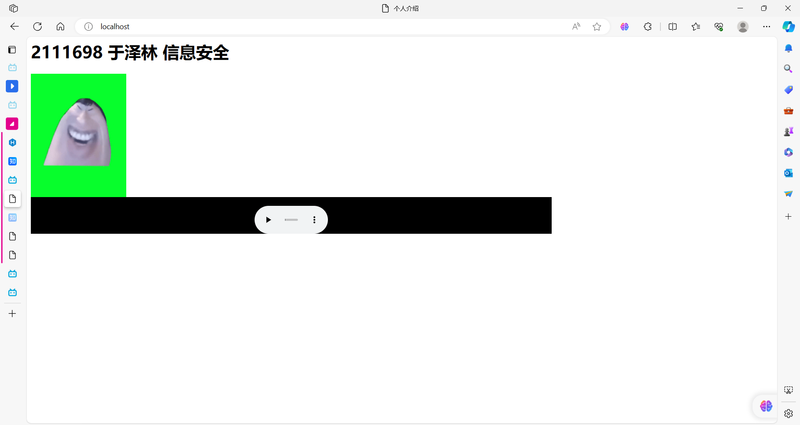
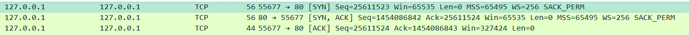
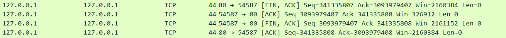

## 计算机网络第二次实验

姓名：于泽林

学号：2111698

专业：信息安全

### 实验要求

（1）搭建Web服务器（自由选择系统），并制作简单的Web页面，包含简单文本信息（至少包含专业、学号、姓名）、自己的LOGO、自我介绍的音频信息。页面不要太复杂，包含要求的基本信息即可。

（2）通过浏览器获取自己编写的Web页面，使用Wireshark捕获浏览器与Web服务器的交互过程，并进行简单的分析说明。

（3）使用HTTP，不要使用HTTPS。

### 实验内容

- 实验web服务器采用apache搭建
- 制作简单的web页面

```
<html>
    <head>
        <meta charset="UTF-8">
        <title>个人介绍</title>
        <h1>2111698 于泽林 信息安全</h1>
    </head>
    <body>
    	
        <br/>
        <embed height="70" width="1000" src="说的道理_01.wav">
    </body>
</html>
```



- wireshark抓包分析

1. 三次握手



第一次握手，客户端55677端口号向服务器端80号端口发起连接，此时标志位flags=S，即SYN=1标志，表示向服务端发起连接的请求，同时生成序列号seq

第二次握手，服务端标志位flags=[S.]，即SYN+ACK标志位设置为1，表示对上一个请求连接的报文进行确认，同时设置ack=seq+1，生成序列号seq

第三次握手，客户端对服务端的响应进行确认，所以此时标志位是[.]即ACK=1，同时返回对上一个报文的seq的确认号ack

> 过滤规则：ip.src == 127.0.0.1 and ip.dst == 127.0.0.1 and tcp and tcp.port==80

2. http请求与响应

```
GET / HTTP/1.1
Host: localhost
Connection: keep-alive
Pragma: no-cache
Cache-Control: no-cache
sec-ch-ua: "Chromium";v="118", "Microsoft Edge";v="118", "Not=A?Brand";v="99"
sec-ch-ua-mobile: ?0
sec-ch-ua-platform: "Windows"
Upgrade-Insecure-Requests: 1
User-Agent: Mozilla/5.0 (Windows NT 10.0; Win64; x64) AppleWebKit/537.36 (KHTML, like Gecko) Chrome/118.0.0.0 Safari/537.36 Edg/118.0.2088.76
Accept: text/html,application/xhtml+xml,application/xml;q=0.9,image/webp,image/apng,*/*;q=0.8,application/signed-exchange;v=b3;q=0.7
Sec-Fetch-Site: none
Sec-Fetch-Mode: navigate
Sec-Fetch-User: ?1
Sec-Fetch-Dest: document
Accept-Encoding: gzip, deflate, br
Accept-Language: zh-CN,zh;q=0.9,en;q=0.8,en-GB;q=0.7,en-US;q=0.6

HTTP/1.1 200 OK
Date: Fri, 03 Nov 2023 08:41:55 GMT
Server: Apache/2.2.25 (Win32) PHP/5.4.8
Last-Modified: Fri, 03 Nov 2023 08:12:45 GMT
ETag: "300000005cd02-129-6093b11b82a52"
Accept-Ranges: bytes
Content-Length: 297
Keep-Alive: timeout=5, max=100
Connection: Keep-Alive
Content-Type: text/html

<html>
    <head>
        <meta charset="UTF-8">
        <title>............</title>
        <h1>2111698 ......... ............</h1>
    </head>
    <body>
    	
        <br/>
        <embed height="70" width="1000" src="fukua.wav">
    </body>
</html>
```

重点分析请求与响应base html的过程，采用GET方式请求主机名为localhost的根目录；响应返回状态码200表示响应成功，返回的是html文本，长度为297字节。

3. 四次挥手



第一次挥手： 服务端发起挥手请求，向客户端发送标志位是FIN报文段，设置序列号seq，此时，服务端端进入`FIN_WAIT_1`状态，这表示服务端没有数据要发送给客户端了。

第二次挥手：客户端端收到了服务端发送的FIN报文段，向服务端返回一个标志位是ACK的报文段，ack设为seq加1，客户端进入`FIN_WAIT_2`状态，客户端告诉服务端，我确认并同意你的关闭请求。

第三次挥手： 客户端向服务端发送标志位是FIN的报文段，请求关闭连接，同时服务端进入`LAST_ACK`状态。

第四次挥手： 服务端收到客户端发送的FIN报文段，向客户端发送标志位是ACK的报文段，然后服务端进入`TIME_WAIT`状态。客户端收到服务端的ACK报文段以后，就关闭连接。此时，服务端等待**2MSL**的时间后依然没有收到回复，则证明客户端已正常关闭，那好，服务端也可以关闭连接了